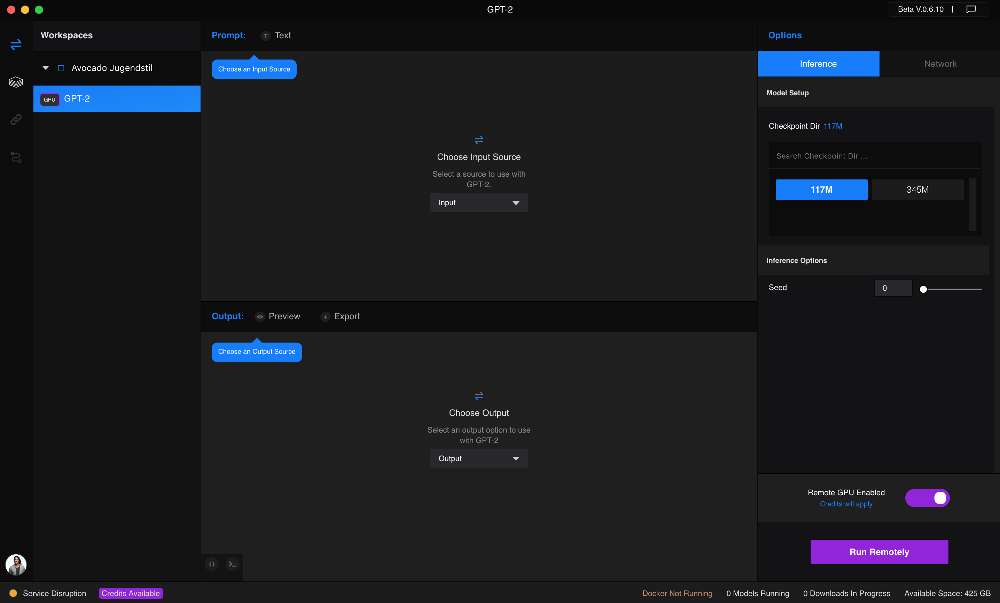
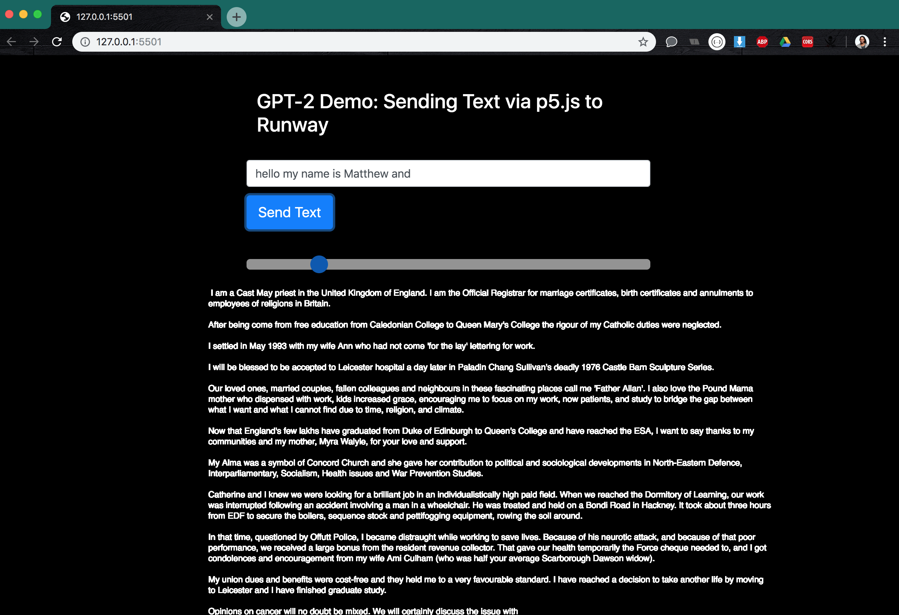

# Runway GPT-2 model with p5.js

## Get Started
1. Open Runway, add the GPT-2 model to your workspace.
    Your Runway interface should look like this:

    

2. Run the sketch
    Go to current directory
    ```
    $ python -m SimpleHTTPServer     # $ python3 -m http.server (if you are using python 3)
    ```
    Go to `localhost:8000` in your browser
3. Enter some text into the text field. Adjust the slider to change the temperature (how "creative" the text will be). Click the "Send Text" button.
    You should be able to see results like this:
    
    